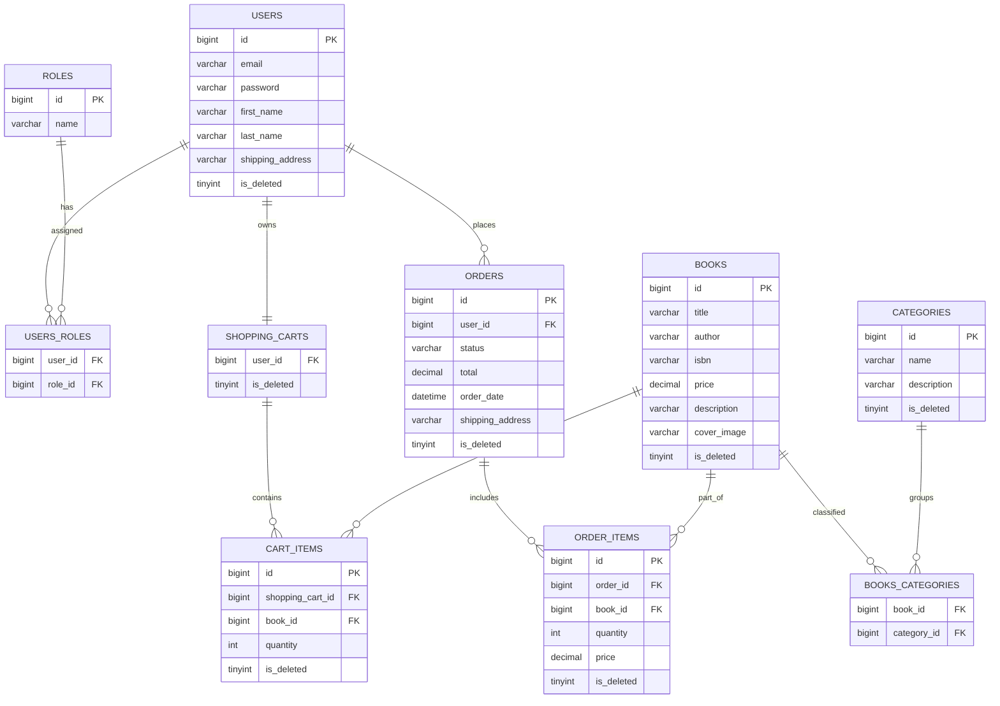

# 📖 BookStore API

**Professional Online Bookstore Management System** - A comprehensive Spring Boot REST API designed for modern e-commerce book sales, featuring advanced authentication, catalog management, and seamless shopping experience.

> *Born from a passion for clean code and scalable architecture, this project demonstrates enterprise-grade development practices while solving real-world e-commerce challenges.*

---

## 💡 Project Inspiration

In today's digital age, online bookstores need robust, scalable APIs that can handle everything from user authentication to complex order management. This project was inspired by the need to create a **production-ready e-commerce solution** that showcases modern Spring Boot development practices.

**The Challenge**: Build a complete bookstore API that handles the entire customer journey - from browsing books to order fulfillment - while maintaining security, performance, and code quality.

**The Solution**: A carefully architected REST API with role-based access, comprehensive testing, and enterprise-grade features that can scale from startup to enterprise level.

---

## ✨ Project Overview

BookStore API is a full-featured e-commerce platform that provides everything needed to run an online bookstore. From user registration to order fulfillment, this system handles the complete customer journey while providing powerful administrative tools for store management.

**Perfect for:** E-commerce businesses, educational projects, portfolio demonstrations, and as a foundation for larger retail systems.

---

## 🎯 Core Features

### 🔐 **Authentication & Security**
- **JWT-based authentication** with secure token management
- **Role-based authorization** (USER/ADMIN privileges)
- **Password encryption** using BCrypt
- **Session management** with configurable token expiration

### 📚 **Book Catalog Management**
- **Complete CRUD operations** for book inventory
- **Advanced search capabilities** (title, author, ISBN)
- **Category-based organization** with hierarchical structure
- **Pagination support** for handling large datasets
- **Soft delete implementation** for data integrity

### 🛒 **Shopping Cart System**
- **Personal shopping carts** for each registered user
- **Real-time cart management** (add, update, remove items)
- **Quantity tracking** and price calculations
- **Seamless order conversion** from cart to purchase

### 📦 **Order Management**
- **Complete order lifecycle** tracking
- **Status management** (PENDING → COMPLETED → DELIVERED)
- **Order history** with detailed item breakdown
- **Administrative order control** for fulfillment

### 🏷️ **Category System**
- **Hierarchical categorization** for better organization
- **Category-based browsing** and filtering
- **Admin category management** tools

---

## 🎯 Controller Functionalities

### 🔐 **AuthController** - Security Gateway
- **User Registration** - Account creation with validation and role assignment
- **Authentication** - Secure login with JWT token generation
- **Password Security** - BCrypt encryption for enhanced security

### 📚 **BookController** - Catalog Management
- **CRUD Operations** - Complete book lifecycle management
- **Advanced Search** - Multi-parameter search (title, author, ISBN, category)
- **Pagination Support** - Efficient handling of large book catalogs
- **Admin Controls** - Secure book creation, updates, and soft deletion

### 🏷️ **CategoryController** - Organization System
- **Category Management** - Hierarchical book organization
- **Category-based Filtering** - Browse books by specific categories
- **Dynamic Relationships** - Many-to-many book-category associations

### 🛒 **ShoppingCartController** - Cart Experience
- **Personal Cart Management** - Individual user shopping carts
- **Real-time Updates** - Add, modify, and remove items instantly
- **Quantity Control** - Flexible item quantity management
- **Session Persistence** - Cart state maintained across sessions

### 📦 **OrderController** - Purchase Processing
- **Order Placement** - Convert cart contents to confirmed orders
- **Status Management** - Track orders through fulfillment pipeline
- **Order History** - Complete purchase history for users
- **Admin Oversight** - Administrative order status control

---

## 🛠️ Technology Stack

### **Backend Framework**
| Technology | Version | Purpose |
|-----------|---------|---------|
| **Spring Boot** | 3.5.3 | Core application framework |
| **Spring Security** | Latest | Authentication & authorization |
| **Spring Data JPA** | Latest | Data persistence layer |
| **Java** | 17 | Programming language |

### **Database & Persistence**
| Technology | Purpose |
|-----------|---------|
| **MySQL** | Production database |
| **H2 Database** | Testing environment |
| **Liquibase** | Database version control & migrations |
| **Hibernate** | ORM with advanced features |

### **Security & Authentication**
| Technology | Version | Purpose |
|-----------|---------|---------|
| **JJWT** | 0.12.6 | JWT token implementation |
| **BCrypt** | Latest | Password hashing algorithm |

### **Development Tools**
| Technology | Version | Purpose |
|-----------|---------|---------|
| **MapStruct** | 1.5.5 | Object mapping automation |
| **Lombok** | Latest | Code generation & boilerplate reduction |
| **Maven** | Latest | Build automation & dependency management |
| **Checkstyle** | Latest | Code quality enforcement |
| **Swagger/OpenAPI 3** | Latest | Interactive API documentation |
| **Docker** | Latest | Application containerization |

### **Testing & Quality**
| Technology | Version | Purpose |
|-----------|---------|---------|
| **JUnit 5** | Latest | Modern testing framework |
| **Mockito** | Latest | Mocking for unit tests |
| **Testcontainers** | 1.18.0 | Integration testing with real databases |
| **MockMvc** | Latest | Spring MVC testing support |

---

## 🗄️ Database Architecture

### **Automated Database Setup**
The project uses **Liquibase** for complete database lifecycle management:
- ✅ Automatic schema creation and updates
- ✅ Reference data population
- ✅ Test users and sample book catalog
- ✅ Foreign key constraints and optimized indexes

### **Entity Relationship Overview**
```
👤 Users ←→ 🔐 Roles (Many-to-Many)
👤 Users → 🛒 Shopping Carts (One-to-One)  
👤 Users → 📦 Orders (One-to-Many)
📚 Books ←→ 🏷️ Categories (Many-to-Many)
🛒 Shopping Carts → 📋 Cart Items (One-to-Many)
📦 Orders → 📋 Order Items (One-to-Many)
```
## 🗄️ Database ER Diagram



### **Pre-loaded Test Data**

#### 🔐 Test Accounts
| Role | Email | Password | Access Level |
|------|-------|----------|--------------|
| **Admin** | admin@example.com | `securePassword123` | Full system access |
| **User** | user@example.com | `securePassword123` | Shopping only |


## 🔌 API Endpoints

### **Authentication Endpoints**
| Method | Endpoint | Description | Access |
|--------|----------|-------------|---------|
| `POST` | `/api/auth/registration` | Register new user account | 🌐 Public |
| `POST` | `/api/auth/login` | User login (returns JWT) | 🌐 Public |

### **Book Management**
| Method | Endpoint | Description | Access |
|--------|----------|-------------|---------|
| `GET` | `/api/books` | Get paginated book list | 👤 User |
| `GET` | `/api/books/{id}` | Get book details by ID | 👤 User |
| `GET` | `/api/books/search` | Advanced book search | 👤 User |
| `POST` | `/api/books` | Create new book | 🔐 Admin |
| `PUT` | `/api/books/{id}` | Update book information | 🔐 Admin |
| `DELETE` | `/api/books/{id}` | Remove book from catalog | 🔐 Admin |

### **Category Management**
| Method | Endpoint | Description | Access |
|--------|----------|-------------|---------|
| `GET` | `/api/categories` | List all categories | 👤 User |
| `GET` | `/api/categories/{id}` | Get category details | 👤 User |
| `GET` | `/api/categories/{id}/books` | Get books by category | 👤 User |
| `POST` | `/api/categories` | Create new category | 🔐 Admin |
| `PUT` | `/api/categories/{id}` | Update category | 🔐 Admin |
| `DELETE` | `/api/categories/{id}` | Delete category | 🔐 Admin |

### **Shopping Cart**
| Method | Endpoint | Description | Access |
|--------|----------|-------------|---------|
| `GET` | `/api/cart` | View shopping cart | 👤 User |
| `POST` | `/api/cart` | Add item to cart | 👤 User |
| `PUT` | `/api/cart/items/{id}` | Update item quantity | 👤 User |
| `DELETE` | `/api/cart/items/{id}` | Remove item from cart | 👤 User |

### **Order Management**
| Method | Endpoint | Description | Access |
|--------|----------|-------------|---------|
| `POST` | `/api/orders` | Place new order | 👤 User |
| `GET` | `/api/orders` | Get user's order history | 👤 User |
| `PATCH` | `/api/orders/{id}` | Update order status | 🔐 Admin |
| `GET` | `/api/orders/{id}/items` | Get order details | 👤 User |
| `GET` | `/api/orders/{id}/items/{itemId}` | Get specific order item | 👤 User |

---

## 🚀 Quick Start Guide

### **Prerequisites**
- ☕ **Java 17** or higher
- 🔧 **Maven 3.6+**
- 🗄️ **MySQL 8.0+**
- 🐳 **Docker** (optional, recommended)

### **Installation Steps**

#### Clone the Repository
```bash
# HTTPS
git clone https://github.com/vbedryk/online-book-store.git

# SSH (if you have SSH keys configured)
git clone git@github.com:vbedryk/online-book-store.git

# Navigate to project directory
cd online-book-store
```

#### Build & Run with Maven
```bash
# Clean and install dependencies
mvn clean install

# Run the Spring Boot application
mvn spring-boot:run
```

### **Docker Setup (Recommended for Development)**
```bash
# Create .env file (copy from .env.example)
cp .env.example .env

# Start with Docker Compose (includes MySQL)
docker-compose up -d

# Verify containers are running
docker-compose ps

# View application logs
docker-compose logs -f app
```

**Docker Environment Variables (.env file):**
```env
# MySQL Configuration
MYSQL_ROOT_PASSWORD=root
MYSQL_DATABASE=bookstore
MYSQL_USER=bookstore_user
MYSQL_PASSWORD=secret

# Application Ports
SPRING_LOCAL_PORT=8080
MYSQL_LOCAL_PORT=3307

# JWT Configuration
JWT_SECRET=my-super-secret-key
JWT_EXPIRATION_TIME=86400000
```

---

## 🧪 Testing Strategy

### **Comprehensive Testing Suite**
Our multi-layered testing approach ensures reliability and maintainability:

#### **Testing Technologies**
- **JUnit 5** - Modern testing framework
- **Mockito** - Unit test mocking
- **Testcontainers** - Integration testing with real databases
- **MockMvc** - Web layer testing
- **@Sql** - Database state management

#### **Test Categories**
| Test Type | Purpose | Technology |
|-----------|---------|------------|
| **Unit Tests** | Service layer logic | JUnit 5 + Mockito |
| **Integration Tests** | Repository layer | Testcontainers + MySQL |
| **Controller Tests** | REST endpoints | MockMvc + Security |
| **Security Tests** | Authentication/Authorization | Spring Security Test |

#### **Running Tests**
```bash
# All tests
mvn test

# Specific test categories
mvn test -Dtest="*RepositoryTest"     # Integration tests
mvn test -Dtest="*ControllerTest"     # Controller tests
mvn test -Dtest="*ServiceTest"        # Unit tests

# Code quality check
mvn checkstyle:check
```

---

## 📖 API Documentation & Testing

### **Interactive Documentation**
Access comprehensive API documentation at:
- **Swagger UI**: `http://localhost:8080/api/swagger-ui.html`
- **OpenAPI Specification**: `http://localhost:8080/api/v3/api-docs`

---

## 🚧 Development Challenges & Solutions

### **Challenge 1: Complex Entity Relationships**
**Problem**: Managing many-to-many relationships between Books and Categories while maintaining data integrity.

**Solution**: Implemented JPA entity relationships with proper cascade settings and soft delete patterns. Used junction tables with optimized queries to prevent N+1 problems.

### **Challenge 2: Security Architecture**
**Problem**: Balancing security with user experience - secure endpoints while maintaining smooth API access.

**Solution**: Designed a layered security approach with JWT stateless authentication, role-based authorization, and method-level security. This eliminated session management complexity while ensuring scalability.

### **Challenge 3: Testing Strategy**
**Problem**: Testing database interactions and security layers without compromising test performance.

**Solution**: Adopted Testcontainers for integration testing with real MySQL instances, combined with comprehensive unit testing using Mockito. This approach provides confidence in database interactions while maintaining fast test execution.

### **Challenge 4: API Documentation**
**Problem**: Keeping API documentation synchronized with code changes and providing interactive testing capabilities.

**Solution**: Integrated Swagger/OpenAPI 3 with automatic documentation generation from code annotations. This ensures documentation always reflects the current API state while providing an interactive testing interface.

---

## 🏗️ Architecture & Design

### **Layered Architecture Pattern**
```
┌─────────────────────────────┐
│      REST Controllers       │ ← API endpoints & request handling
├─────────────────────────────┤
│       Service Layer         │ ← Business logic & transactions
├─────────────────────────────┤
│     Repository Layer        │ ← Data access & persistence  
├─────────────────────────────┤
│       Entity Models         │ ← Database mapping & relationships
└─────────────────────────────┘
```

### **Key Design Principles**
- ✅ **DTO Pattern** - Clean API communication
- ✅ **Repository Pattern** - Data access abstraction
- ✅ **Service Layer** - Business logic encapsulation
- ✅ **Soft Delete** - Data integrity preservation
- ✅ **JWT Stateless** - Scalable authentication
- ✅ **Database Migrations** - Version-controlled schema
- ✅ **Comprehensive Testing** - Quality assurance

---

## 🔒 Security Features

| Security Layer | Implementation | Benefit |
|----------------|---------------|---------|
| **Password Security** | BCrypt hashing | Secure password storage |
| **Authentication** | JWT tokens | Stateless, scalable auth |
| **Authorization** | Role-based access | Granular permission control |
| **Input Validation** | Bean Validation | Data integrity protection |
| **SQL Injection** | JPA/Hibernate ORM | Automatic query sanitization |
| **Data Protection** | Soft delete pattern | Recovery & audit capabilities |

---

## 🚀 Production Deployment

### **Pre-deployment Checklist**
- [ ] Update JWT secret key for production
- [ ] Configure production database connection
- [ ] Set up SSL/TLS certificates
- [ ] Configure application logging
- [ ] Set up health monitoring
- [ ] Implement database backup strategy
- [ ] Configure environment variables

### **Environment Configuration**
```bash
# Production environment variables
export SPRING_DATASOURCE_URL="jdbc:mysql://prod-db:3306/bookstore"
export SPRING_DATASOURCE_USERNAME="bookstore_user"
export SPRING_DATASOURCE_PASSWORD="secure_production_password"
export JWT_SECRET="production-strength-secret-key"
export JWT_EXPIRATION="86400000"
```

---

## 🤝 Contributing

We welcome contributions from the community! Here's how you can help:

### **Development Workflow**
1. **Fork** the repository
2. **Create** a feature branch: `git checkout -b feature/amazing-feature`
3. **Follow** existing code style and run Checkstyle validation
4. **Add** comprehensive tests for new functionality
5. **Commit** with descriptive messages: `git commit -m 'Add amazing feature'`
6. **Push** to branch: `git push origin feature/amazing-feature`
7. **Open** a Pull Request with detailed description

### **Development Standards**
- ✅ Follow Java naming conventions and best practices
- ✅ Use Lombok annotations to reduce boilerplate
- ✅ Write comprehensive tests (unit + integration + controller)
- ✅ Maintain test coverage above 80%
- ✅ Use Testcontainers for integration testing
- ✅ Follow existing DTO patterns and layered architecture
- ✅ Validate code with Checkstyle before committing

---


## 👨‍💻 Contact & Support

**Developer**: Vladyslav Bedryk
- 🐙 **GitHub**: [@vbedryk](https://github.com/vbedryk)
- 💼 **LinkedIn**: https://www.linkedin.com/in/vladyslav-bedryk-9a39b4193

**Project Repository**: [BookStore API on GitHub](https://github.com/vbedryk/online-book-store)

---
